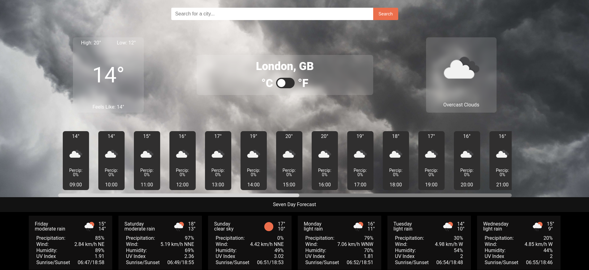

# Weather - App

> Simple one page application using the Open Weather API

## Table of contents

- [Overview](#overview)
  - [Features](#features)
  - [Screenshot](#screenshot)
  - [Links](#links)
- [My process](#my-process)
  - [Built with](#built-with)
- [Author](#author)

## Overview

### Features

- [x] Displays the highs, lows and current temperature of a city
- [x] Displays the current forecast
- [x] Allows you to switch from Celsius to Farenheit throughout the whole page
- [x] Displays the temperature and forecast of the next 24 hours divided hourly
- [x] Dsiplays the temperature and forecast of the next 7 days divided daily
- [x] Background image corresponding to the current weather
- [x] Use of degrees-to-direction to display the wind direction
- [x] Webpack and npm to bundle the JS files
- [x] Fully Responsive

### Screenshot

### Links

> View the project [here](https://funkosaur.github.io/Funtasktick/)

## My process

### Built with

- HTML5
- SCSS
- Flexbox
- CSS Grid
- Javascript
- ES6
- Open Weather API
- ESLint
- degrees-to-direction
- Webpack

## Author

- Website - [Mario Boykovski](https://github.com/funkosaur)
